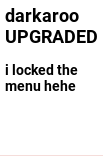

# Darkaroo

Darkaroo is a Chrome extension that gives you **ads** everywhere. 

Most interestingly, it features YouTube ad integration that pauses ads **if you're looking away from the screen**, and unskippable ad popups that close only when you **yell** `Bussin Industries`.

### Extension - User Interface

### Extension - Example after ~3 minutes on google.com

## Features

- **Anti-Adblock detection**: it bricks any website you load if you have an adblocker installed.

- **Scam buttons**: frequently spawns scam-looking buttons in the corners of your screen. Clicking has 50% of working, 50% of redirecting to a fork bomb.

- **Unskippable auto-playing volume-on floating video ads**: basically what the title says

https://github.com/user-attachments/assets/20a2552c-1b30-4a0c-8b1e-36271ab33b31

#### BUT! You can close them by yelling "Bussin Industries"
vidfeo here

**the other 1 here todo**

- **Website Popup Ads**
A random popup ad for a **random** website from our dataset of the **2,500** most visited websites on the web. Publicly available at `extension/data/dataset/data`.

## Installation

1. Download the source code for this project.
2. Go to `chrome://extensions`, enable "Developer mode", click "Load unpacked" & select the "extension" folder.
3. Click on the Darkaroo icon in the toolbar.
4. If you want **vision** & **audio** functionality, open a command prompt in `server` & run `$ python main.py`.

### Installing Python (for vision & audio)

1. Download the latest version of Python from the [official website](https://www.python.org/downloads/).
2. Run the installer and follow the instructions. Make sure to check the box that says "Add Python to PATH".
3. Verify the installation by opening a command prompt and running `python --version`. You should see the installed Python version.

## Usage

1. Open any website.
2. Click on the Darkaroo icon in the toolbar.
3. Adjust the settings as needed.

## Contributing

We welcome contributions!

## License

This project is licensed under the Apache 2.0 License. See the [LICENSE](LICENSE) file for details.

## Contact

business.facedev@gmail.com
